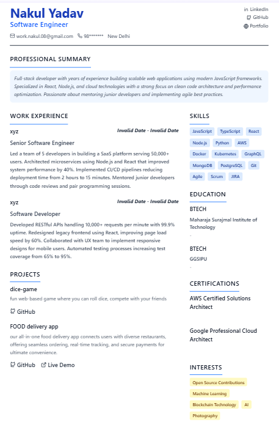

# 🚀 Resume Builder (MERN Stack)

A modern, full-featured resume builder web application that allows users to create, customize, and manage professional resumes using various interactive templates.

[🔗 Live Demo](https://resume-builder-frontend-g8kc.onrender.com)


---

## 🛠️ Tech Stack

- **Frontend**: React.js + Tailwind CSS + Vite
- **Backend**: Node.js + Express.js
- **Database**: MongoDB (via Mongoose)
- **Authentication**: JWT-based login/signup
- **Image Processing**: `html2canvas` for thumbnail previews
- **PDF/PNG Export**: Canvas capture of resume for download
- **Deployment**: Render (Frontend + Backend)

---

## ✨ Features

- 🧑‍💼 **Create, Edit, and Delete Resumes**
- 🎨 **Multiple Custom Templates**
- 📷 **Live Preview with Thumbnail**
- 📥 **Download Resume as PNG**
- 📱 **Responsive & Mobile-Friendly**
- 🔒 **User Authentication**
- 🆕 **"New" Badge for Recent Resumes**
- 📊 **Completion Tracker (%)**
- 🧠 **Smart Data Suggestions (like autosaving structure)**

---

## 📂 Folder Structure

```
frontend/
  └── components/
  └── pages/
  └── utils/
  └── assets/
  └── main.jsx
backend/
  └── controllers/
  └── models/
  └── routes/
  └── middleware/
  └── server.js
```

---

## 📦 Setup Instructions

### 1️⃣ Clone the Repository

```bash
git clone https://github.com/NAKUL-XD/resume-builder.git
cd resume-builder
```

### 2️⃣ Setup Backend

```bash
cd backend
npm install
# Configure your MongoDB URI and JWT secret in .env
npm run dev
```

### 3️⃣ Setup Frontend

```bash
cd ../frontend
npm install
npm run dev
```

> 💡 Ensure MongoDB is running and CORS is properly configured.

---

## 📸 Screenshots

| Dashboard | Resume Template | Mobile View |
|----------|----------------|-------------|
|  |  |  |

---

## 🧪 Todo & Improvements

- [ ] Add PDF export
- [ ] Add real-time collaboration
- [ ] Add light/dark themes
- [ ] Improve accessibility (a11y)

---

## 📜 License

This project is licensed under the [MIT License](LICENSE).

---

## 🙋‍♂️ Author

Made with ❤️ by [Nakul Yadav](https://github.com/NAKUL-XD)
